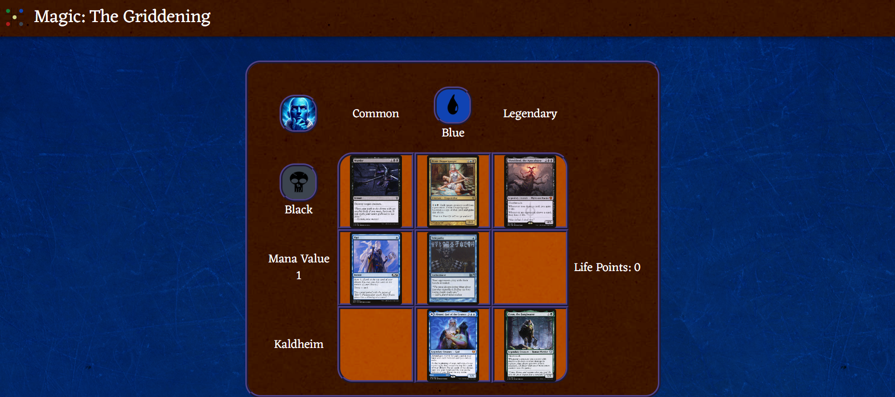
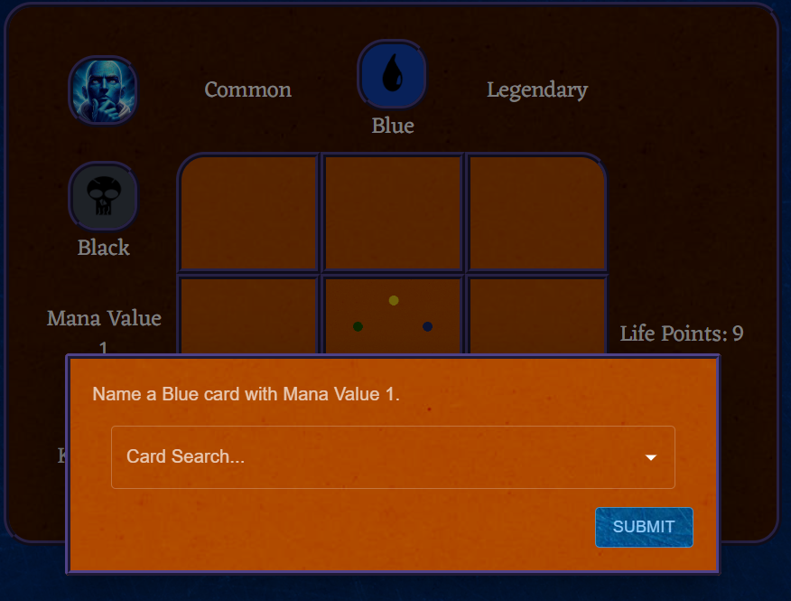
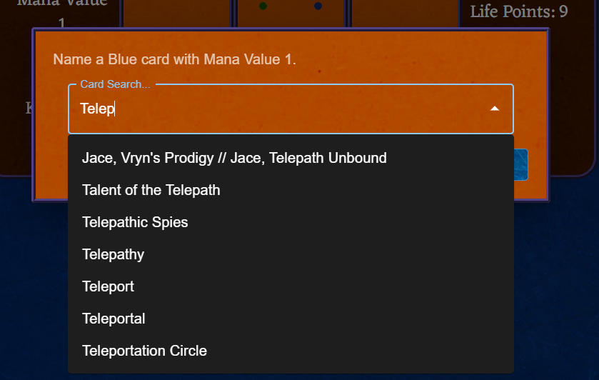

# Magic: The Griddening

A game in the style of [The Immaculate Grid](https://www.immaculategrid.com/) but for Magic cards.

Puzzles are currently automatically generated, but we verify that at least 20 viable answers exist for each intersection.

